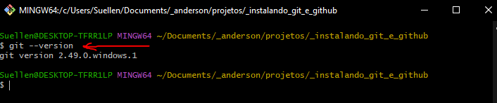
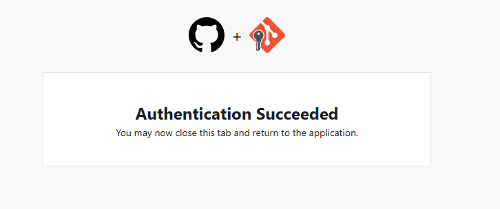

# Instalando o Git e integrando com o Github na prática

Esse projeto tem como objetivo demonstrar, de forma prática, como instalar e configurar o Git, integrá-lo ao GitHub e realizar o upload de projetos. O passo a passo detalhado facilita o entendimento de cada etapa, desde a instalação até o envio de arquivos para o repositório remoto. Ideal para iniciantes!

## Passo 1
### Download do Git

Imagem Clicável

Após o processo de download, instale o Git no seu equipamento, no meu caso aqui foi utilizado no meu período o *Windows 10*. Mas o mesmo pode ser baixado em diversos sistemas operacionais como *Mac* quanto *Linux* veja qual melhor te atende para esse processo e verifique as diferenças de instalação.

**IMPORTANTE:** Ao final do processo de instalação do Git selecione a opção apresentada.

Neste projeto faremos todo processo de instalação no sistema operacional *Windows 10*.

## Passo 2
### Crie um diretório

Diretório Local

#### Diretório Local

Neste processo criei um diretório local chamado **"_instalando_git_e_github"** e coloquei ele em qualquer lugar no meu equipamento. Mas é muito importante saber em qual local ele se encontra.

#### Diretório Online

Diretório Online

Após o processo anterior fui até a [página do Github](https://github.com) crei meu usuário e depois disso crie o meu primeiro diretório o qual ficom com o seguinte nome/endereço ([andersonbfigueiredo/instalando_git_e_github](https://github.com/andersonbfigueiredo/instalando_git_e_github.git)).

Clicando nestas urls você já irá para os caminhos já apresentados nas imagens

## Passo 3
### Crie um arquivo neste diretório local

Quando você criar um **diretório online no Github** ele já te traz a orientação de qual arquivo criar com a nomenclatura devida, *mas isso é algo opicional que pode ser feito de outra forma*. Neste caso aqui como é um processo de formação oriento para que faça da mesma forma.

README.md

> MD = **Markdown** é uma linguagem de formatação simples que converte texto em HTML, facilitando a criação de documentos bem estruturados com sintaxe fácil de ler e escrever.  
> [Saiba+](https://pt.wikipedia.org/wiki/Markdown)

## Passo 4
### Editor de texto ou código

Novamente no meu caso aqui estou usando o editor **VS Code**, mas você pode utilizar qualquer um da sua escolha.

> **VS Code** é um editor de código leve, poderoso e personalizável, com suporte a diversas linguagens e extensões para desenvolvimento eficiente.  
> [Download+](https://code.visualstudio.com/download)

Edição do README.md, neste processo lhe sugiro escrever somente uma linha, frase ou palavra somente para ver como fica no processo final e após isso poderá fazer as atualizações necessárias.

## Passo 5
### Acessando o Git Bash

Após a instalação do Git, VS Code e criação de conta no Github + os diretórios (local/online) criados agora iremos para o **Git Bash**.

Para acessa-lo é bem simples, primeiro clique com o botão direito do mouse na área de trabalho após feito isso aparecerá algo assim:

**IMPORTANTE:** Lembre-se que é sobre a área de trabalho, se clicar sobre o arquivo README.md não irá ocorrer da mesma forma.

## Passo 6
### Quais comandos utilizar e porque?

#### Comando 1

##### git --version

Este comando serve para verificar se a versão que baixou e instalou é a mesma que está sendo utilizada pelo Git Bash.

#### Comando 2

##### git init

Este comando serve para inicializar um repositório **Git**.

Observe a imagem e veja o que ocorreu nas setas:
1. Local do Git Bash que foi criado o comando *git init*.
2. Veja que um usuário *Master* apareceu no final do endereço do caminho do local do equipamento.
3. Veja que também foi criado um subdiretório no seu diretório principal chamado *.git*. Recomendo fortemente que ***NÃO*** apague/delete esse subdiretório.

#### Comando 3

##### git add

Este comando serve para adicionar todos os arquivos criados dentro deste diretório.

**Orientação:**
1. Pode ser feito o comando *git add README.md*
2. Pode ser feito o comando *git add .*, ou seja tudo que estiver dentro deste diretório será adicionando.

> **Observação:** É muito importante saber o local que está autenticado/logado, ou seja o diretório que está porque senão quando efetivar esse comando e se estiver por exemplo na sua raíz do diretório *c:* o comando irá compreender que tudo que estiver dentro do seu dispositivo deverá se adicionado.

#### Comando 4

##### git status

Este comando serve para te apresentar o que foi adicionado no seu diretório do Git temporário.

> **Observação:** Veja que esse comando lhe apresenta os arquivos e diretórios adicionados, assim como os modificados.

#### Comando 5

##### git commit -m "primeiro commit"

Essa marcação *git commit* permite corrigir o *commit* mais recente.

> **Observação:** Isso é muito útil quando você esquece de preparar um arquivo ou para omitir informações importantes da mensagem do commit.

Veja que agora não se tem mais nenhum arquivo para ser *"commitado".*

#### Comando 6

##### git branch -M "main"

Esse comando nos permite criar, listar, renomear e excluir ramificações (branches). As *branches* são linhas independentes de desenvolvimento que permitem isolar alterações e trabalhar em paralelo.

Neste processo observe que sai de *(master)* para *(main)* é muito importante aonde estiver desenvolvendo verificar em qual *Branch* estão padronizados para ter sinergia em seu desenvolvimento.

#### Comando 7

##### git remote

Esse comando permite criar, ver e excluir **conexões** com outros repositórios.

Neste processo o comando a ser utilizado é <nobr>`git remote add origin https://github.com/andersonbfigueiredo/instalando_git_e_github.git`</nobr> que faz o instanciamento do meu repositório local com o meu repositório online.

###### Caso a minha conexão não funcione o que irá acontecer?

> Neste processo o próprio Git irá lhe orientar para que fazer a **configural** de "*user.name*" ou "*user.email*", já o comando para isso poderá ser:
1. "*user.name*" = `git config --global "SeuUsuarioLocal"`
2. "*user.email*" = `git config --global "SeuUsuarioEmail@email.com"`

Essa opção serve para definir configurações que serão aplicadas a todos os repositórios do usuário no sistema. 

###### Mas o que irá acontecer após isso?

> Após o processo anterior a conexão será pré-estabelecida, solicitando as suas autenticações de usuário e senha da conta do **Github** que criamos anteriormente.

1. Modal inicial

2. Página de Login

3. Página de Confirmação de autenticação

#### Comando 8

##### git push

Serve para **enviar** alterações locais do repositório para um repositório online.

Neste processo o comando a ser utilizado é <nobr>`git push -u origin main`</nobr>, o que fundamental para colaborar em projetos de software, permitindo compartilhar o trabalho com outros colaboradores.

## Conclusão

Esse pequeno post tem por principal objetivo facilitar a configuração do desenvolvedor inicial para a real utilização do Git e GitHub.

## Referências
*Rafaella Ballerini*
https://github.com/rafaballerini

Obrigado Rafaella a sua explicação é simplesmente fantástica e parabéns por fazer o que faz com muito zelo e paixão.

## Tecnologias utilizadas

| App Local 1 | App Local 2 | App Local 3 |          | App Online |
|:------------:|:------------:|:------------:|:------------:|:------------:|
| Git | VS Code | Markdown |          | GitHub |
|   | | |          |   |

Créditos das imagens: [Icon8](https://icons8.com.br/icons)

  <strong>Anderson Brito de Figueiredo</strong> | Inspirado para facilitar a aprendizagem | 2025

